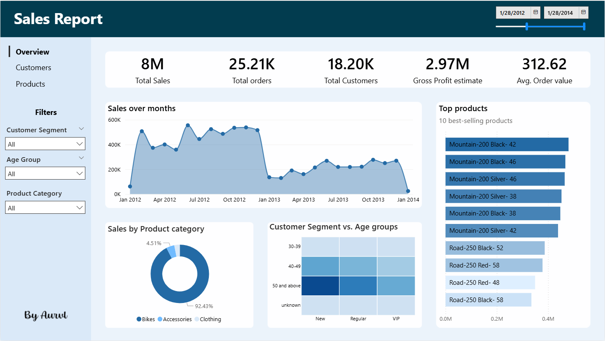
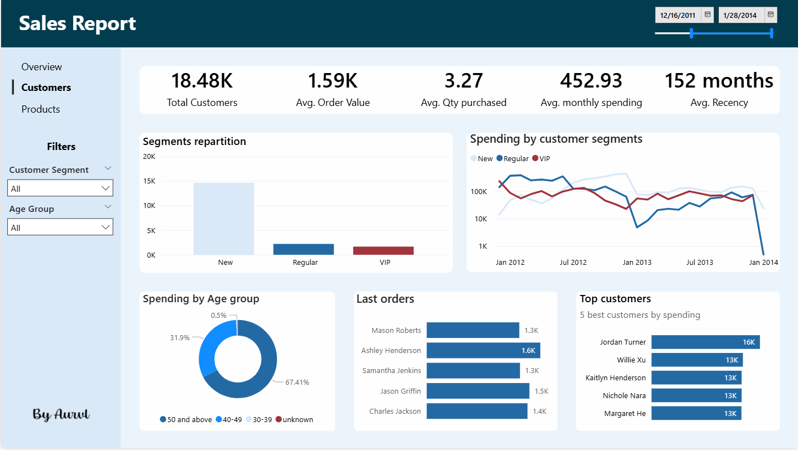
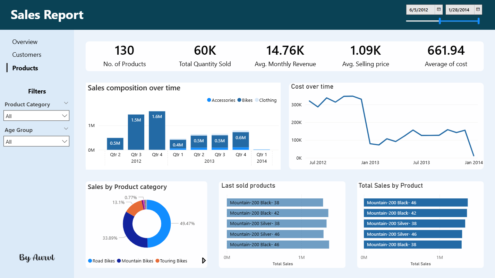

# Sales Analytics Dashboard | PostgreSQL + Power BI

## Overview

This project delivers an end-to-end sales analytics workflow designed to transform raw retail data into business-ready insights.

The objective is not only to analyze sales transactions, but to structure the data into a reporting layer that supports decision-making through interactive dashboards. The project combines SQL-based data transformation, business-oriented reporting views, and a final Power BI dashboard focused on three core perspectives:

- overall business performance
- customer behavior and segmentation
- product performance and category analysis

This type of solution can help a retail business monitor revenue trends, identify high-value customers, track product performance, and support commercial and marketing decisions with data.

---

## Business Problem

Raw sales data alone is rarely useful for decision-making. Businesses need clear metrics and structured answers to questions such as:

>- Which customers generate the most value?
>- Which products drive the most revenue?
>- Which customer segments should be retained or targeted?
>- Which categories underperform?
>- How recent is customer activity?
>- How is performance evolving over time?

This project addresses those questions by building a reporting layer and a dashboard that translate transactional data into actionable business insights.

---

## Project Structure

```text
.
├── README.md
├── db
│   ├── gold.dim_customers.csv
│   ├── gold.dim_products.csv
│   └── gold.fact_sales.csv
├── scripts
│   ├── init_database.sql
│   ├── business_analytics.sql
│   └── data_query.sql
└── dashboard
    ├── sales_report.pbix
    ├── heatmap.json
    ├── colors.xlsx
    ├── illust.png
    ├── background.pptx
    └── model
        ├── Slide1.PNG
        ├── Slide3.PNG
        ├── Slide5.PNG
        ├── background1.png
        └── background2.png
````

---

## Data Sources

The analysis is based on three core datasets:

* `gold.fact_sales.csv` → transactional sales data
* `gold.dim_customers.csv` → customer attributes
* `gold.dim_products.csv` → product attributes

These files are loaded into a PostgreSQL database and then transformed through SQL scripts into reporting-ready views.

---

## Data Architecture

The project follows a simple analytical architecture:

1. Raw CSV files are loaded into PostgreSQL.
2. SQL scripts create a structured reporting layer.
3. Power BI connects to the transformed views for dashboarding.

The final model is centered around:

* `gold.fact_sales`
* `gold.dim_customers`
* `gold.dim_products`

This structure makes it possible to apply dimensional thinking and build dashboards that remain easy to maintain and extend.

---

## Reporting Layer

To simplify dashboard construction and keep business logic close to the data source, the project uses dedicated reporting views.

### `gold.report_customers`

Customer-level reporting view with metrics such as:

* total orders
* total sales
* total quantity
* total products purchased
* last order date
* recency in months
* customer lifespan
* average order value
* average monthly spend
* age group
* customer segment

Customer segmentation includes:

* **VIP**
* **Regular**
* **New**

This view helps identify valuable customers and understand customer quality beyond simple customer counts.

### `gold.report_products`

Product-level reporting view with metrics such as:

* total sales
* total quantity
* total customers
* average selling price
* average order revenue
* average monthly revenue
* product lifespan
* recency in months
* product segment

Product segmentation includes:

* **High-Performer**
* **Mid-Performer**
* **Low-Performer**

This view helps identify best-sellers, weak products, and performance differences across categories.

### `gold.report_overview`

Overview-level reporting view designed for the executive dashboard page.

It combines transaction-level sales data with customer and product attributes, including:

* order date and order month
* customer segment
* age group
* product category and subcategory
* sales amount and quantity
* unit selling price
* estimated gross profit

This view supports high-level monitoring without relying on multiple disconnected tables inside Power BI.

---

## Dashboard Pages

The Power BI report is structured into three pages.

#### 1. Overview

This page provides a high-level summary of overall business performance.

#### 2. Customers

This page focuses on customer behavior and customer value.

#### 3. Products

This page focuses on product portfolio performance.

---

## Tools and Technologies

* **PostgreSQL**
* **SQL**
* **Power BI**
* **CSV**
* **Business Intelligence**
* **Data Modeling**

---

## Installation and Setup

### 1. Clone the repository

```bash
git clone <your-repository-url>
cd sales_analysis
```

### 2. Create the database

Make sure PostgreSQL is installed and running, then create the database:

```sql
CREATE DATABASE datawarehouse;
```

### 3. Load the source data

Run the initialization script to create tables and load the CSV files into PostgreSQL.

```bash
psql -U username -d datawarehouse -f scripts/init_database.sql
```

### 4. Create the reporting views

Run the transformation script:

```bash
psql -U username -d datawarehouse -f scripts/data_query.sql
```

### 5. Open the Power BI dashboard

Open:

```text
dashboard/sales_report.pbix
```

Then connect Power BI to your local PostgreSQL instance and the `datawarehouse` database.

---

## Business Value

This project can help a business:

* monitor sales performance over time
* identify high-value customers
* detect inactive or declining customer groups
* understand customer spending patterns
* monitor best-selling and underperforming products
* optimize category and product strategy
* support data-driven commercial and marketing decisions

In practice, this dashboard could be used by a sales manager, a marketing team, a category manager, or a business analyst.

---

## Skills Demonstrated

This project highlights my ability to:

* structure raw business data for analytics
* design business-oriented SQL transformations
* build reporting views for BI use cases
* create KPI-driven dashboards in Power BI
* apply dimensional modeling concepts
* translate raw data into decision-ready insights
* communicate analytical results in a business-oriented way

---

## Dashboard Preview

### Overview



### Customers



### Products



---